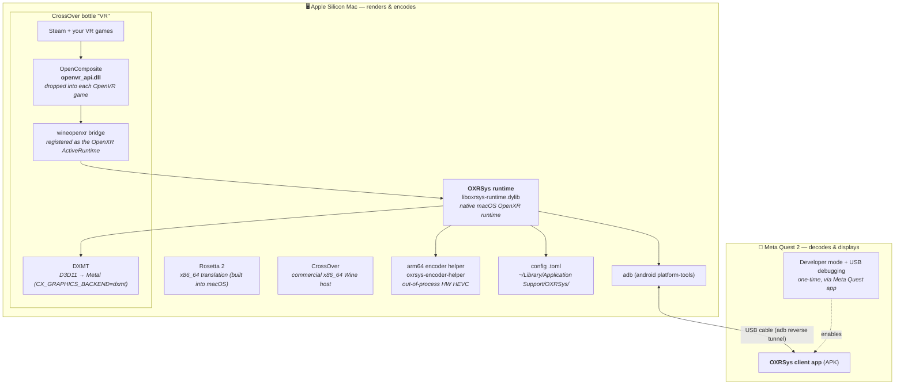
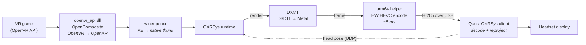

# Fresh install — what you need to run Windows SteamVR games on Apple Silicon

This bridge runs **Windows OpenVR/OpenXR games on an Apple Silicon Mac** and
streams them to a **Meta Quest** headset, with **hardware HEVC** encoding — no
Windows PC, no SteamVR (which has had no macOS build since 2020).

## The two-device picture

Everything lives on two devices: your **Mac** (renders + encodes) and your
**Quest** (decodes + displays), joined by a **USB cable** (adb tunnel).



## Runtime data flow (what happens when you press Play in Steam)



## Install checklist

### On the Mac (Apple Silicon)
| # | Component | What / where | How you get it |
|---|-----------|--------------|----------------|
| 1 | **Rosetta 2** | x86_64 translation | built into macOS (`softwareupdate --install-rosetta`) |
| 2 | **CrossOver** | x86_64 Wine host | commercial — codeweavers.com |
| 3 | **CrossOver bottle `VR`** | the Windows environment | create a Win10 x64 bottle named `VR` |
| 4 | **Steam + games** | inside the bottle | install Steam in the bottle, then your VR titles |
| 5 | **OpenComposite `openvr_api.dll`** | dropped into each OpenVR game | **built by CI** (see below); deploy with `scripts/provision-all-steamvr.sh` |
| 6 | **wineopenxr bridge** | `C:\openxr\wineopenxr64.json` + DLLs, set as `HKLM\Software\Khronos\OpenXR\1\ActiveRuntime` | `bridge/` submodule |
| 7 | **DXMT** | `CX_GRAPHICS_BACKEND=dxmt` in the bottle | `dxmt/` submodule |
| 8 | **OXRSys runtime** | `liboxrsys-runtime.dylib` + `oxrsys-encoder-helper` (arm64) | `oxrsys-src/` submodule |
| 9 | **OXRSys config** | `~/Library/Application Support/OXRSys/oxrsys-runtime.toml` | `transport = "usb_adb"`, `encoder_helper = true` |
| 10 | **adb** | USB tunnel to the headset | `brew install android-platform-tools` |
| 11 | **BlackHole** *(for headset audio)* | loopback device; route the game's output to it | `brew install blackhole-2ch` — see [Headset audio](#headset-audio-optional) |

### Headset audio (optional)
To hear game sound in the headset: install **BlackHole** (`brew install blackhole-2ch`),
create a **Multi-Output Device** (BlackHole 2ch + your speakers) in Audio MIDI Setup
and select it as the system output, set `headset_audio = true` in the OXRSys config,
and install the audio-enabled Quest client APK. A Core Audio tap does **not** work
under CrossOver (silence — needs System-Audio-Recording permission it can't request);
reading a loopback **input** uses CrossOver's Microphone permission instead. USB only.
Full steps: see the README's *Headset audio* section.

### On the Quest 2
| # | Component | How you get it |
|---|-----------|----------------|
| 11 | **Developer mode + USB debugging** | enable in the Meta Quest phone app (one-time) |
| 12 | **OXRSys client app (APK)** | sideload onto the headset |

## Getting `openvr_api.dll` (CI-built)

You do **not** need to build OpenComposite yourself. GitHub Actions
cross-compiles it to a Windows x86_64 `openvr_api.dll` on every push:

- **Repo:** `anoshmisiosdev/OpenComposite`, branch **`merged-fixes`**
- **Workflow:** *Build openvr_api.dll (mingw-w64)* → download the
  `openvr_api-dll-win64` artifact, or grab it from a tagged **Release**.
- Then drop it into every installed OpenVR game in one shot:
  ```bash
  scripts/provision-all-steamvr.sh            # provision all games (idempotent)
  scripts/provision-all-steamvr.sh --restore  # put the stock DLLs back
  ```

> Built with **mingw-w64 (GCC), not MSVC** — on purpose. The MSVC↔GCC x64 ABI
> trampolines in this fork are GCC-specific and must be built with mingw g++ to
> be ABI-correct against the MSVC-compiled games the DLL is dropped into.

## Why each piece exists (the short version)
- **Rosetta 2 + CrossOver** — the games and the whole Wine host are x86_64, so
  they run under Rosetta. This is the load-bearing constraint: the OXRSys runtime
  dylib is loaded *in-process*, so it must be x86_64 too. Native arm64 is only
  possible for **out-of-process** helpers — which is exactly why the HW HEVC
  encoder is a separate **arm64 helper** (VideoToolbox hardware encode is
  unreachable from an x86_64/Rosetta process).
- **OpenComposite** translates the game's OpenVR calls to OpenXR.
- **wineopenxr** thunks those PE-side OpenXR calls to the native macOS runtime.
- **OXRSys** is that native runtime — it renders (via **DXMT**: D3D11→Metal),
  encodes, and streams to the headset over USB.
